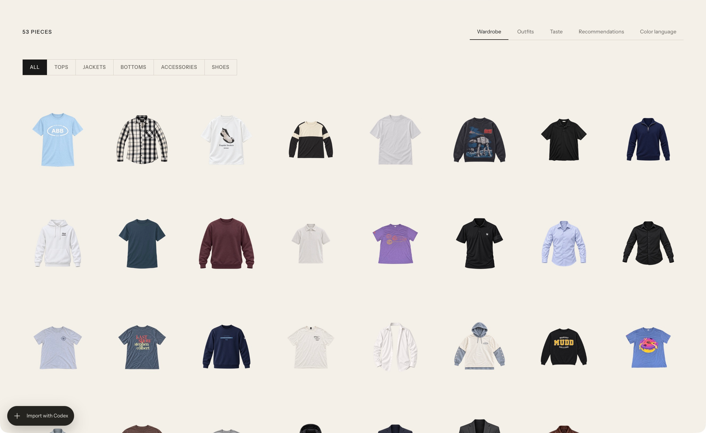
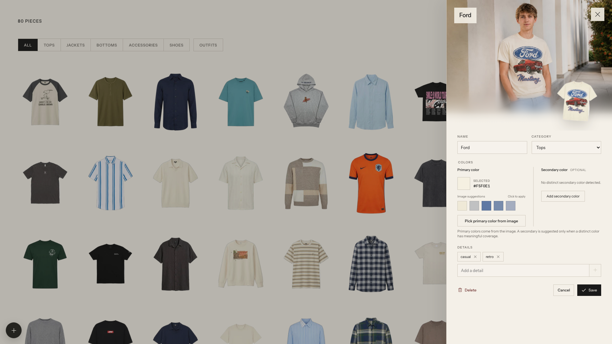

# Clothes — my wardrobe

A local wardrobe app for organizing clothes, creating outfits, understanding personal style, and finding new pieces that work with an existing collection.

This project builds on **[Wardrobe](https://github.com/tandpfun/wardrobe) by [Thijs Simonian (@tandpfun)](https://github.com/tandpfun)**. Thank you, Thijs, for creating and sharing the original app. The starting source was copied from upstream commit [`f44006cce7e4779e595a35b25fbbc8dabc68d7e4`](https://github.com/tandpfun/wardrobe/tree/f44006cce7e4779e595a35b25fbbc8dabc68d7e4). This version adds personal setup instructions, an outfit studio, style and color analysis, and shopping recommendations. The original MIT copyright and license are preserved in [LICENSE](LICENSE), alongside the copyright for this version's additions.

## Get started

Use Node.js 22 or newer and npm.

```sh
git clone https://github.com/heli-belii/clothes.git
cd clothes
npm ci
cp .env.example .env
mkdir -p data
npm run dev -- --host 127.0.0.1
```

Open the local address printed by Vite, normally [localhost:5173](http://localhost:5173). A fresh checkout starts with an empty wardrobe. Keep the server running while using the app.

Imports default to `WARDROBE_IMPORT_MODE=codex`; no API key is required for this mode. Open the project in Codex, provide your own clothing photos and identity references, and use the bundled [import-clothes skill](.agents/skills/import-clothes/SKILL.md). The optional browser importer uses separately billed API calls and must be enabled explicitly. See [the setup guide](docs/PERSONAL_SETUP.md) for both workflows.

## Explore your wardrobe

- **Wardrobe:** Browse imported clothes and edit their details.
- **Outfits:** Combine owned pieces, save and compare looks, and generate modeled previews. See [the outfit studio guide](docs/OUTFIT_STUDIO.md).
- **Taste:** View your style profile and the clothing that supports it.
- **Recommendations:** Set a budget and shopping preferences, then click **Find recommendations**. The app refreshes your style first and automatically researches matching products. Preferences and saved responses stay in this tab.
- **Color language:** Explore your wardrobe palette and combinations of owned clothes. See [the Taste guide](docs/TASTE.md).

The local outfit, style, and shopping runners use Codex signed in with ChatGPT. Modeled photos require your own identity references; this repository does not include them.

## Keep personal files private

Store original photos, identity references, cutouts, modeled images, wardrobe records, and generated results inside `data/`. Keep credentials in `.env`. Both are Git-ignored. Common photo and video formats are also ignored outside `data/` to help catch accidental additions. The only allowed tracked photos are the two unchanged public screenshots from the original project.

```sh
npm run check
```

This checks tracked working files, staged files, and available Git history for private paths, unreviewed media, and recognized secret patterns, then runs the tests and production build. CI fetches the full history and runs the same checks. The privacy check is a guard rather than a complete secret scanner; review changes before committing and never force-add personal files. See [CONTRIBUTING.md](CONTRIBUTING.md).

Making the source repository public does not publish your ignored local wardrobe. Running the app as a public website is a separate task: the current app has no user authentication and should run on localhost with personal data. See [hosting notes](docs/PERSONAL_SETUP.md#build-and-hosting).

## Original project screenshots

These are unchanged screenshots from [tandpfun/wardrobe](https://github.com/tandpfun/wardrobe), not this copy's personal wardrobe or the latest interface.





## License

[MIT](LICENSE). Original project: [Wardrobe](https://github.com/tandpfun/wardrobe), by [Thijs Simonian](https://github.com/tandpfun). [Original announcement](https://x.com/cdngdev/status/2076812846793650485).
