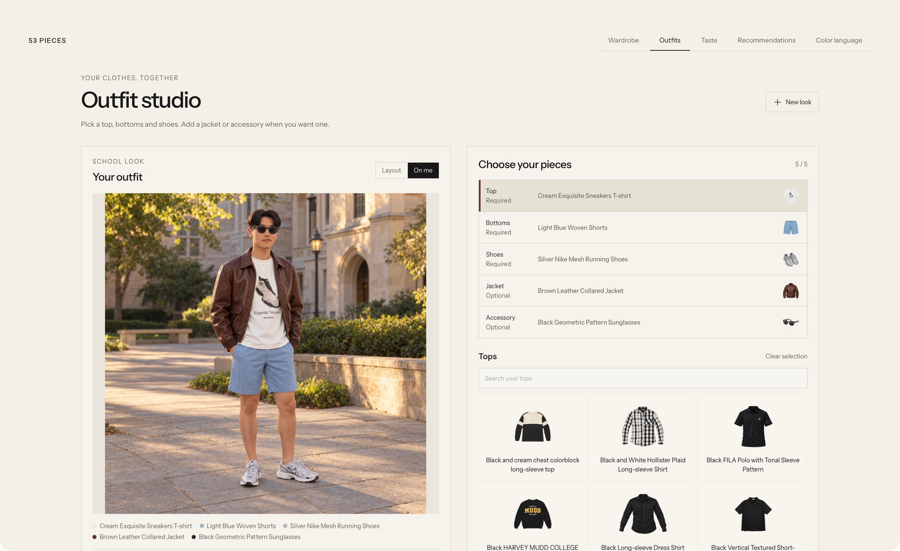
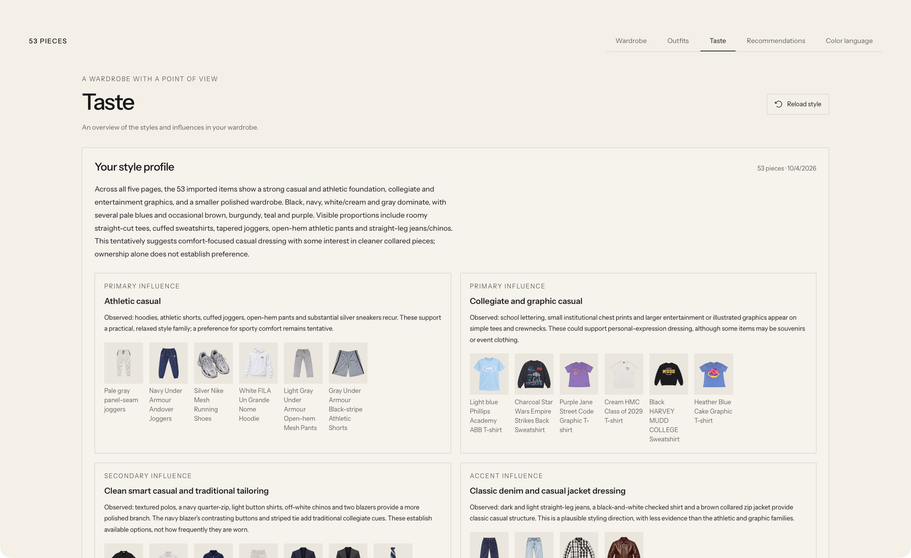
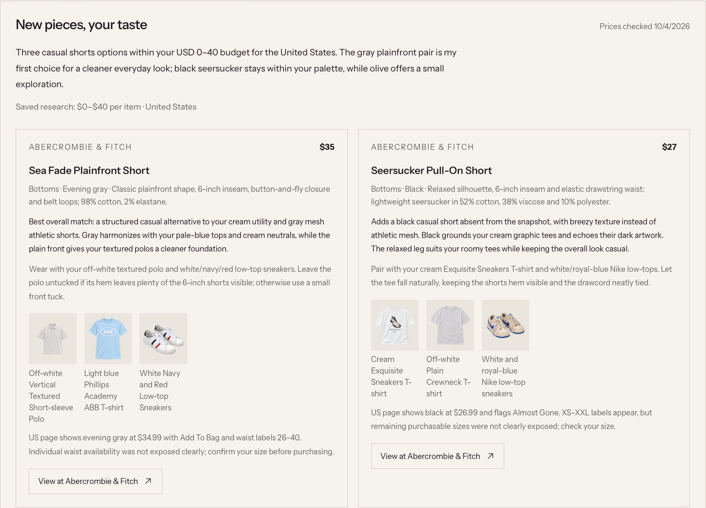
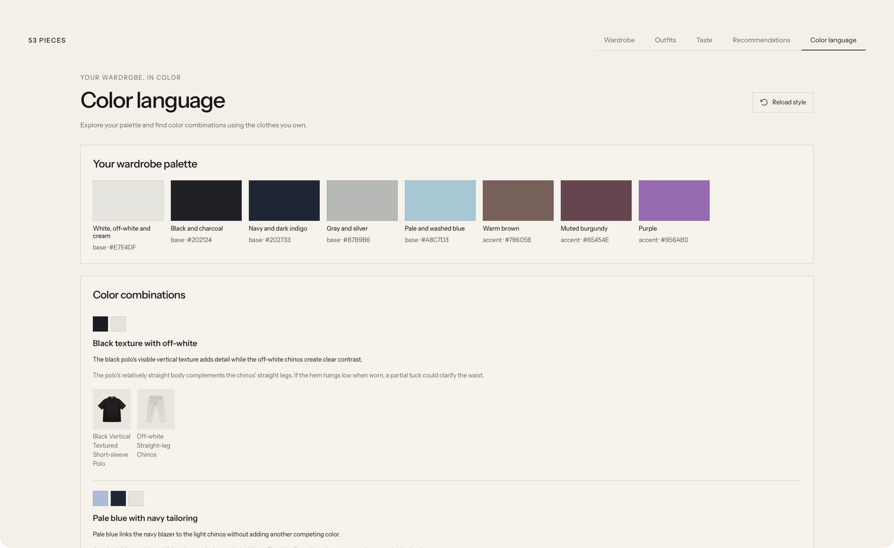

# Clothes — my wardrobe

A local wardrobe app for organizing clothes, planning outfits, and discovering your style.

Based on [Wardrobe](https://github.com/tandpfun/wardrobe) by [Thijs Simonian (@tandpfun)](https://github.com/tandpfun), starting from commit [`f44006c`](https://github.com/tandpfun/wardrobe/tree/f44006cce7e4779e595a35b25fbbc8dabc68d7e4). Thank you, Thijs, for sharing the original project. Its MIT license and copyright are preserved in [LICENSE](LICENSE).

## Wardrobe

Browse your clothes, filter by category, and edit each piece.


## Outfits

Combine owned pieces, save looks, and preview them on yourself. [Guide](docs/OUTFIT_STUDIO.md).



## Taste

See your style overview, with evidence from the clothes you own.



## Recommendations

Set your budget and preferences; the app refreshes your style, then finds matching products.



## Color language

Explore your wardrobe palette and color combinations. [Guide](docs/TASTE.md).



## Run locally

Requires Node.js 22+ and npm.

```sh
git clone https://github.com/heli-belii/clothes.git
cd clothes
npm ci
cp .env.example .env
mkdir -p data
npm run dev -- --host 127.0.0.1
```

Open [localhost:5173](http://localhost:5173). [Setup and hosting](docs/PERSONAL_SETUP.md).

## AI usage

I choose to use my ChatGPT-authenticated Codex usage for this version, rather than separately billed API calls. Keep `WARDROBE_IMPORT_MODE=codex` and sign in to Codex with ChatGPT. [Authentication](https://learn.chatgpt.com/docs/auth).

For **API browser imports**, add your own [API key](https://developers.openai.com/api/docs/quickstart) to the ignored `.env` file:

```dotenv
WARDROBE_IMPORT_MODE=api
OPENAI_API_KEY=your-api-key
WARDROBE_MODEL_REFERENCE=data/model-reference.png
```

Provide a real PNG at that reference path and restart the server. API imports are billed separately; outfits, Taste, and recommendations still use Codex. [Full instructions](docs/PERSONAL_SETUP.md#optional-separately-billed-browser-imports).

## Privacy and checks

Personal photos, wardrobe data, and generated assets stay in Git-ignored `data/`; credentials stay in `.env`. Private agent preferences belong in `data/AGENTS.local.md`. Only reviewed README screenshots are intentionally public.

Run `npm run check` for the privacy audit, tests, and build. [Contributing](CONTRIBUTING.md).
